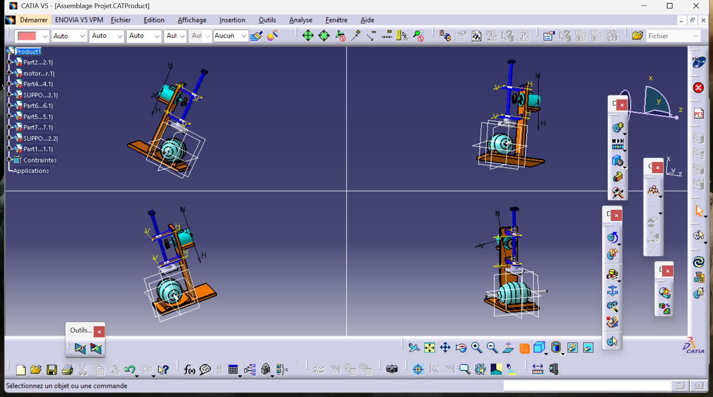

# Artificial Respirator Mechanism (Respirateur Artificiel)
Design of a mechanical ventilator system intended for emergency respiratory support.
The mechanism converts rotary motion from a DC motor into a linear compression stroke to actuate an Ambu bag.

## 📸 Assembly Views
Simulation of the compression mechanism:

## ⚙️ System Components
- **Actuation:** DC Motor with reduction gear.
- **Transmission:** Cam & Follower / Crank-Slider mechanism.
- **Support:** Frame designed to hold the manual resuscitator (Ambu bag).
