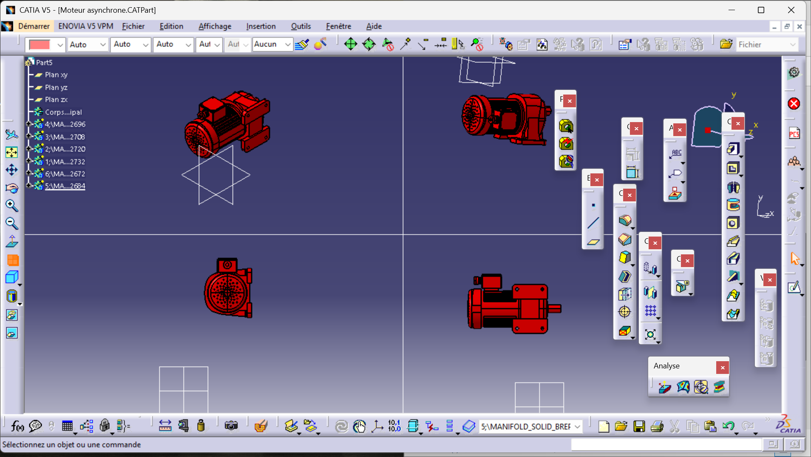

# Asynchronous Motor Design (Moteur Asynchrone)
3D Modeling of an industrial Asynchronous Induction Motor using CATIA V5.
Focus on external housing details and cooling system design.

## 📸 Motor Views
Detailed view of the housing, cooling fins, and terminal box:

## ⚡ Design Highlights
- **Cooling Fins:** Detailed modeling for thermal dissipation.
- **Housing & Stator Frame:** Robust mechanical structure.
- **Terminal Box:** Connection interface design.
