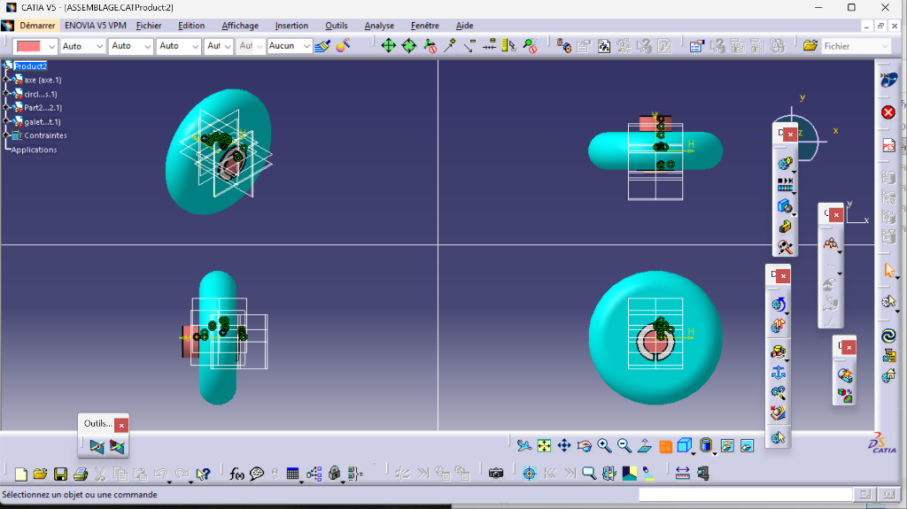

# Axe-Galet Assembly (Mécanisme Axe-Galet)
Mechanical assembly designed in CATIA V5. It demonstrates the use of standard locking components (Circlips & Key) to secure a rotating roller.

## 📸 Assembly Views
The design includes 4 standard mechanical components:

## 🛠️ Components List
1.  **Axe (Axle):** The main shaft (Red).
2.  **Galet (Roller):** The rotating part (Cyan).
3.  **Clavette (Key):** Prevents rotation between the axle and the support (Red).
4.  **Circlips:** Retaining ring to hold the assembly in place (White).
