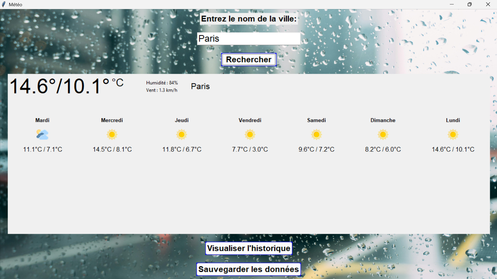

# Weather Forecast Desktop App (Application Météo)
A desktop application developed in Python that provides real-time weather data and weekly forecasts.

## 📸 App Interface
The GUI allows users to search for cities, view current stats, and save history.

## 💻 Features
- **Real-time Data:** Fetches Temperature, Humidity, and Wind Speed via API.
- **7-Day Forecast:** Displays weather trends for the upcoming week.
- **Data Persistence:** Features to "Save Data" and "View History" (Visualiser l'historique).
- **GUI:** Built using Python (Tkinter/PyQt).
