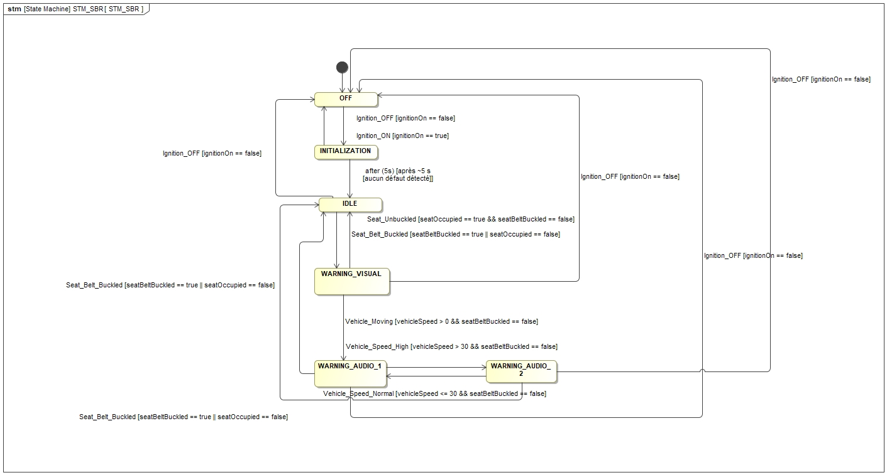
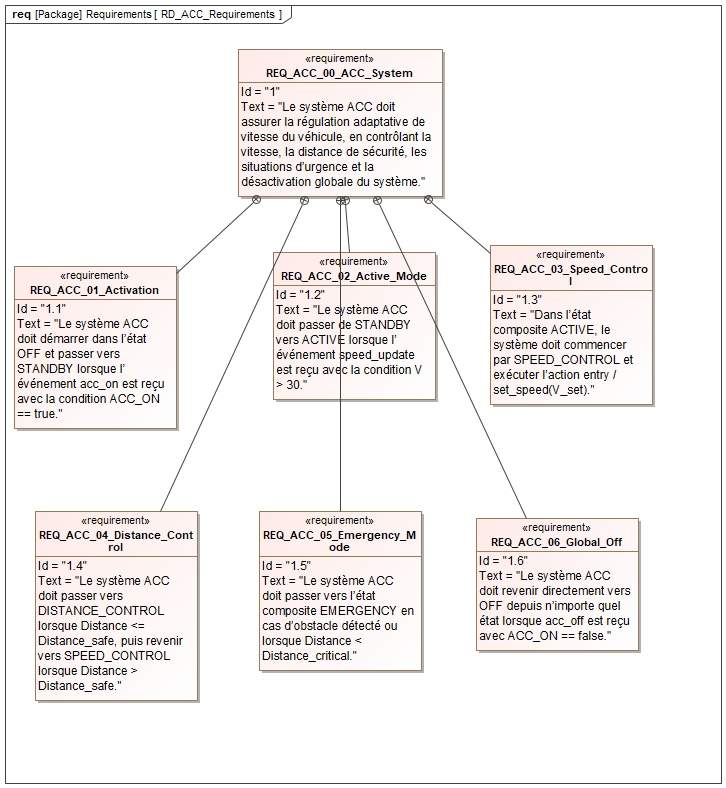
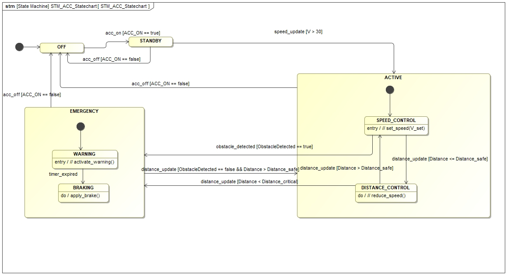

# 🚗 Software Engineering & SysML: Automotive Systems

This section of the portfolio contains practical lab work focused on **Software Engineering** and **Model-Based Systems Engineering (MBSE)** for critical automotive features. The projects utilize SysML for modeling requirements and dynamic state behaviors.

---

## 1. Seat Belt Reminder (SBR) System
State machine modeling for an automotive Seat Belt Reminder. The system handles ignition states, seat occupancy detection, and speed-dependent logic to trigger visual and audio warnings.

  

---

## 2. Adaptive Cruise Control (ACC)

### 📋 ACC Requirements Diagram
Definition of functional requirements ensuring safe operations, including speed regulation, maintaining safe distances, and handling emergency scenarios.

  

### ⚙️ ACC Statechart
Complex state transitions managing the entire Adaptive Cruise Control lifecycle: Standby, Active Speed/Distance Control, and automatic switching to Emergency braking modes.

  

---
**Tech Stack:** SysML, State Machine Diagrams, Automotive Logic, Software Engineering Principles.